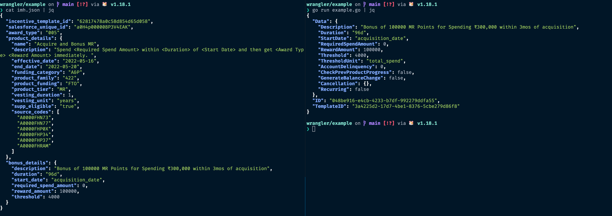

# Wrangler

A small library to wrangle structs from one format to another 

Take a look at the tests or the example folder for usage (TODO: Full docs)

## Example 

The example folder contains a quick example of transforming an iMH request like so...

Its only one feature as a proof of concept

## TODOs

* Docs
* Consolidate the way populate is done now
